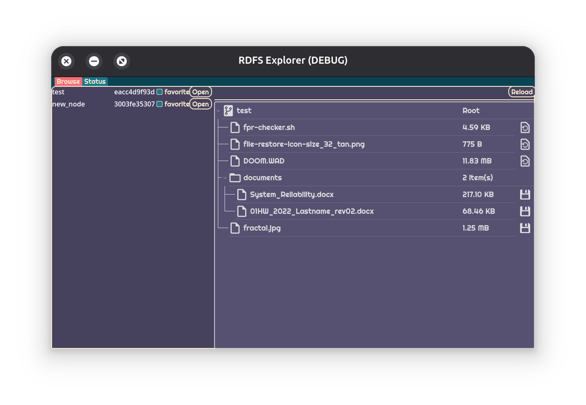
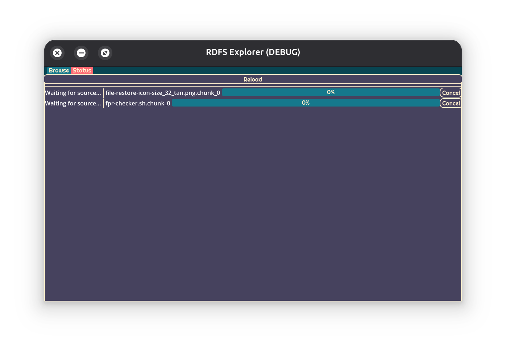

# RDFS_Explorer
Godot gui application taking advantage of Reticulim Decentralized File Server's api to provide file access and management features to the file server
## Browsing Tab
Tab for viewing files in the server and requesting, downloading, deletingm or adding files

## Status Tab
Tab for monitoring the current status of your local file server node

